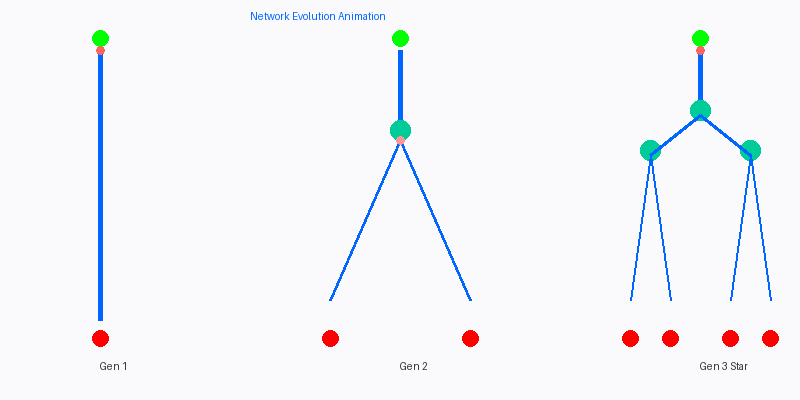

# 🌊 Enio Carlos | Flow Dynamics & Computational Physics

<div align="center">

### 🌊 Animated Flow Network Evolution 🌊

<div align="center">



**Red particles flowing through 3 generations → Network evolves for minimum resistance** 🌊

</div>
  <!-- GENERATION 1: Simple Path -->
  <g id="gen1">
    <!-- Source -->
    <circle cx="80" cy="60" r="8" fill="#00ff00" stroke="#00aa00" stroke-width="2"/>
    <!-- Main channel -->
    <line x1="80" y1="68" x2="80" y2="200" stroke="#0066ff" stroke-width="4"/>
    <!-- Animated particle 1 -->
    <circle r="4" fill="#ff3333">
      <animate attributeName="cy" values="68;200;68" dur="3s" repeatCount="indefinite"/>
      <animate attributeName="opacity" values="1;1;0" dur="3s" repeatCount="indefinite"/>
    </circle>
    <!-- Sink -->
    <circle cx="80" cy="215" r="8" fill="#ff0000" stroke="#aa0000" stroke-width="2"/>
    <!-- Label -->
    <text x="80" y="250" text-anchor="middle" font-size="14" font-weight="bold" fill="#333">Gen 1</text>
    <text x="80" y="268" text-anchor="middle" font-size="11" fill="#666">Random</text>
  </g>
  
  <!-- GENERATION 2: Branching Network -->
  <g id="gen2">
    <!-- Source -->
    <circle cx="240" cy="60" r="8" fill="#00ff00" stroke="#00aa00" stroke-width="2"/>
    <!-- Main stem -->
    <line x1="240" y1="68" x2="240" y2="130" stroke="#0066ff" stroke-width="4"/>
    <!-- Junction node (pulsing) -->
    <circle cx="240" cy="140" r="6" fill="#00cc99" stroke="#0099cc" stroke-width="2">
      <animate attributeName="r" values="6;9;6" dur="2s" repeatCount="indefinite"/>
      <animate attributeName="opacity" values="1;0.7;1" dur="2s" repeatCount="indefinite"/>
    </circle>
    <!-- Left branch -->
    <line x1="240" y1="146" x2="180" y2="200" stroke="#0066ff" stroke-width="3"/>
    <!-- Right branch -->
    <line x1="240" y1="146" x2="300" y2="200" stroke="#0066ff" stroke-width="3"/>
    <!-- Animated particles on branches -->
    <circle r="4" fill="#ff3333">
      <animate attributeName="x" values="240;180" dur="2.5s" repeatCount="indefinite"/>
      <animate attributeName="y" values="140;200" dur="2.5s" repeatCount="indefinite"/>
    </circle>
    <circle r="4" fill="#ff6666">
      <animate attributeName="x" values="240;300" dur="2.5s" repeatCount="indefinite" begin="0.5s"/>
      <animate attributeName="y" values="140;200" dur="2.5s" repeatCount="indefinite" begin="0.5s"/>
    </circle>
    <!-- Sinks -->
    <circle cx="180" cy="215" r="7" fill="#ff0000" stroke="#aa0000" stroke-width="2"/>
    <circle cx="300" cy="215" r="7" fill="#ff0000" stroke="#aa0000" stroke-width="2"/>
    <!-- Label -->
    <text x="240" y="250" text-anchor="middle" font-size="14" font-weight="bold" fill="#333">Gen 2</text>
    <text x="240" y="268" text-anchor="middle" font-size="11" fill="#666">Branching</text>
  </g>
  
  <!-- GENERATION 3: Optimized (Constructal) -->
  <g id="gen3">
    <!-- Source -->
    <circle cx="400" cy="60" r="8" fill="#00ff00" stroke="#00aa00" stroke-width="2"/>
    <!-- Level 1 -->
    <line x1="400" y1="68" x2="400" y2="110" stroke="#0066ff" stroke-width="5"/>
    <circle cx="400" cy="120" r="6" fill="#00cc99" stroke="#0099cc" stroke-width="2">
      <animate attributeName="r" values="6;9;6" dur="2s" repeatCount="indefinite"/>
    </circle>
    <!-- Level 2 branches -->
    <line x1="400" y1="126" x2="340" y2="155" stroke="#0066ff" stroke-width="4"/>
    <line x1="400" y1="126" x2="460" y2="155" stroke="#0066ff" stroke-width="4"/>
    <!-- Level 2 junctions -->
    <circle cx="340" cy="160" r="5" fill="#00cc99" stroke="#0099cc" stroke-width="2">
      <animate attributeName="r" values="5;7;5" dur="2s" repeatCount="indefinite" begin="0.33s"/>
    </circle>
    <circle cx="460" cy="160" r="5" fill="#00cc99" stroke="#0099cc" stroke-width="2">
      <animate attributeName="r" values="5;7;5" dur="2s" repeatCount="indefinite" begin="0.66s"/>
    </circle>
    <!-- Level 3 micro-branches -->
    <line x1="340" y1="165" x2="310" y2="200" stroke="#0066ff" stroke-width="2.5"/>
    <line x1="340" y1="165" x2="370" y2="200" stroke="#0066ff" stroke-width="2.5"/>
    <line x1="460" y1="165" x2="430" y2="200" stroke="#0066ff" stroke-width="2.5"/>
    <line x1="460" y1="165" x2="490" y2="200" stroke="#0066ff" stroke-width="2.5"/>
    <!-- Animated particles flowing down -->
    <circle r="3" fill="#ff3333">
      <animate attributeName="x" values="400;310" dur="3s" repeatCount="indefinite"/>
      <animate attributeName="y" values="68;200" dur="3s" repeatCount="indefinite"/>
    </circle>
    <circle r="3" fill="#ff6666">
      <animate attributeName="x" values="400;370" dur="3s" repeatCount="indefinite" begin="0.5s"/>
      <animate attributeName="y" values="68;200" dur="3s" repeatCount="indefinite" begin="0.5s"/>
    </circle>
    <circle r="3" fill="#ffaaaa">
      <animate attributeName="x" values="400;430" dur="3s" repeatCount="indefinite" begin="1s"/>
      <animate attributeName="y" values="68;200" dur="3s" repeatCount="indefinite" begin="1s"/>
    </circle>
    <circle r="3" fill="#ffcccc">
      <animate attributeName="x" values="400;490" dur="3s" repeatCount="indefinite" begin="1.5s"/>
      <animate attributeName="y" values="68;200" dur="3s" repeatCount="indefinite" begin="1.5s"/>
    </circle>
    <!-- Sinks -->
    <circle cx="310" cy="215" r="6" fill="#ff0000" stroke="#aa0000" stroke-width="2"/>
    <circle cx="370" cy="215" r="6" fill="#ff0000" stroke="#aa0000" stroke-width="2"/>
    <circle cx="430" cy="215" r="6" fill="#ff0000" stroke="#aa0000" stroke-width="2"/>
    <circle cx="490" cy="215" r="6" fill="#ff0000" stroke="#aa0000" stroke-width="2"/>
    <!-- Label -->
    <text x="400" y="250" text-anchor="middle" font-size="14" font-weight="bold" fill="#333">Gen 3</text>
    <text x="400" y="268" text-anchor="middle" font-size="11" fill="#666">Optimized ⭐</text>
  </g>
  
  <!-- Title -->
  <text x="325" y="30" text-anchor="middle" font-size="18" font-weight="bold" fill="#0066ff">🌊 Constructal Law: Network Evolution 🌊</text>
  <text x="325" y="48" text-anchor="middle" font-size="12" fill="#00cc99">Particles flowing through evolving networks → Minimum resistance</text>
</svg>

---


</div>

> **"For a finite-size system to persist in time, it must evolve in such a way that it provides easier access to the imposed currents that flow through it."**
>
> — Adrian Bejan, Constructal Law (1997)

## 🚀 Current Research

<div align="center">

```
┏━━━━━━━━━━━━━━━━━━━━━━━━━━━━━━━━━━━━━━━━━━━━━━━━━━━━━━━━━┓
┃  Investigating Flow Network Evolution Under               ┃
┃     Finite Geometric Constraints                          ┃
┃                                                            ┃
┃  Physics + Math + Computation = Network Optimization      ┃
┗━━━━━━━━━━━━━━━━━━━━━━━━━━━━━━━━━━━━━━━━━━━━━━━━━━━━━━━━━┛
```

</div>

I investigate how **flow networks evolve** to minimize resistance under finite constraints through computational modeling and optimization. My work bridges physics, mathematics, and computational science.

### 🔬 Research Areas

- **Fluid Dynamics** — Laminar flow, resistance minimization
- **Computational Physics** — Numerical methods, network solvers
- **Network Evolution** — Topological optimization, algorithms
- **Extended Physics** — Thermal networks, mass transport

## 💻 Featured Project

<div align="center">

```
╭─────────────────────────────────────────────────────────╮
│                                                         │
│  🌊  CONSTRUTAL FLOW OPTIMIZER  🌊                     │
│                                                         │
│     A Framework for Network Evolution Analysis          │
│                                                         │
╰─────────────────────────────────────────────────────────╯
```

</div>

### [→ Construtal Flow Optimizer ←](https://github.com/eniocarlossoilook34-netizen/construtal-flow-optimizer)

**Complete research framework with 5 integrated phases:**

```
Phase 1 ████████████████████ 100% ✅ Hydraulic Physics
Phase 2 ████████████████████ 100% ✅ Geometric Optimization  
Phase 3 ████████████████████ 100% ✅ Topological Evolution
Phase 4 ████████████████████ 100% ✅ Multi-Objective Optimization
Phase 5 ████████████████████ 100% ✅ Extended Physics (Thermal, Transport)

═══════════════════════════════════════════════════════════════
Overall: ████████████████████ 100% | Tests: 66/66 ✓ | Production Ready 🚀
═══════════════════════════════════════════════════════════════
```

## 📊 Skills & Technologies

<div align="center">

```
╔═══════════════════════════════════════════════════════════╗
║           🛠️  TECHNICAL SKILLSET  🛠️                    ║
╚═══════════════════════════════════════════════════════════╝
```

</div>

### 💻 Languages & Libraries


### 🔬 Core Expertise

```
Numerical Methods
  ├─ Linear solvers (Gaussian elimination, LU decomposition)
  ├─ ODE/PDE integration & eigenvalue problems
  └─ Error analysis & numerical stability

Optimization Algorithms  
  ├─ Gradient-based (steepest descent, adaptive learning)
  ├─ Evolutionary (genetic algorithms, tournament selection)
  ├─ Multi-objective (NSGA-II, Pareto frontiers)
  └─ Metaheuristics (simulated annealing)

Physics Modeling
  ├─ Fluid mechanics (Hagen-Poiseuille, laminar flow)
  ├─ Heat transfer (Fourier's Law, thermal networks)
  ├─ Mass transport (Fick's Law, diffusion)
  └─ Multi-physics coupling

Software Engineering
  ├─ Test-driven development (66 tests, >90% coverage)
  ├─ Reproducible research & deterministic algorithms
  ├─ Clean code (PEP 8, type hints, docstrings)
  └─ Git version control & collaborative workflows
```

## 🎓 Background

- Scientific research & computational physics
- Fluid mechanics & hydraulic networks
- Numerical methods & solver development
- Optimization & multi-objective problems
- Network science & topology

## 📚 Key References

- Bejan, A. (1997). Constructal-theory network. *Int. J. Heat Mass Transfer*.
- White, F.M. (2011). *Fluid Mechanics* (7th ed.).
- Deb, K. et al. (2002). NSGA-II algorithm. *IEEE Trans. Evol. Comput.*

## 🔗 Connect

- **Email:** eniocarlossoilook34@gmail.com
- **GitHub:** [@eniocarlossoilook34-netizen](https://github.com/eniocarlossoilook34-netizen)
- **Open to:** Collaboration & research partnerships

---

<div align="center">

```
╔══════════════════════════════════════════════════════════════════╗
║                                                                  ║
║             ~~~  FLOW DYNAMICS RESEARCH  ~~~                    ║
║                                                                  ║
║         🌊 Fluids in Motion                                     ║
║         ⚡ Networks in Evolution                                ║
║         💻 Physics in Code                                      ║
║                                                                  ║
║    "Nature designs optimally to facilitate access to flow"      ║
║                   — Constructal Law                              ║
║                                                                  ║
╚══════════════════════════════════════════════════════════════════╝
```

### Let's collaborate on network evolution research! 🤝

[](mailto:eniocarlossoilook34@gmail.com)
[](https://github.com/eniocarlossoilook34-netizen)
[](https://linkedin.com/in/enio-carlos-b2756198/)

</div>
